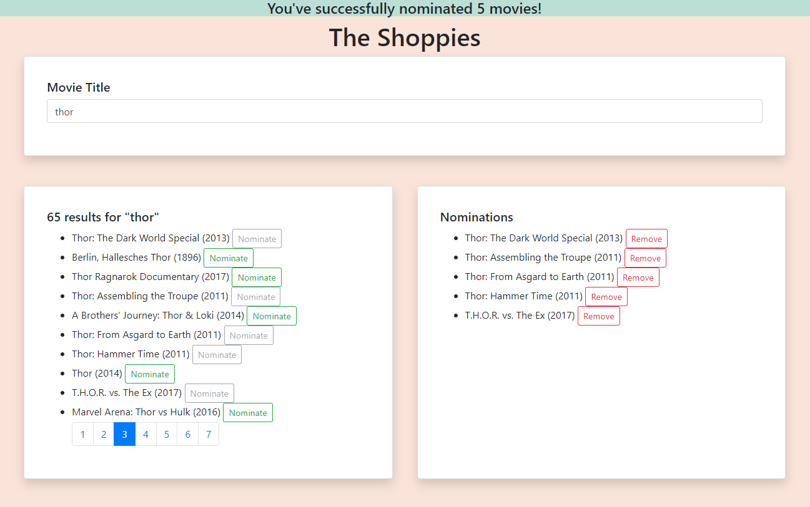

The Shoppies is a webiste that allows you to search OMDB for movies and allows you to nominate your favorite ones.

The Shoppies is made using:

React is used to create the responsive user interface.

Reactstrap is used to easily implement aesthetic components in React.

The OMDb API is the open movie database used to fetch movie data from.

GitHub Pages is used to deploy this website.
